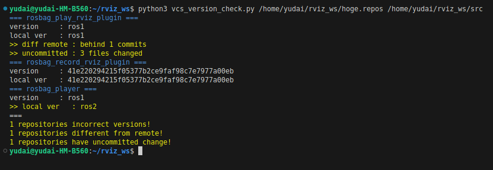

# version check script for vcstool



## Usage

```
python3 ~/vcs_version_check.py ~/hoge_ws/hoge.repos ~/hoge_ws/src
or
python3 ~/vcs_version_check.py ~/hoge_ws/hoge.repos ~/hoge_ws/src --nofetch  # Fast but may be out of sync with remote
```

### output description

- version: defined repository version (by .repos)
- local ver: current local repository version
- diff remote: ahead and behind from remote repository
- uncommitted: uncommitted changes in local repository


---
2023.12 yudai.yamazaki
